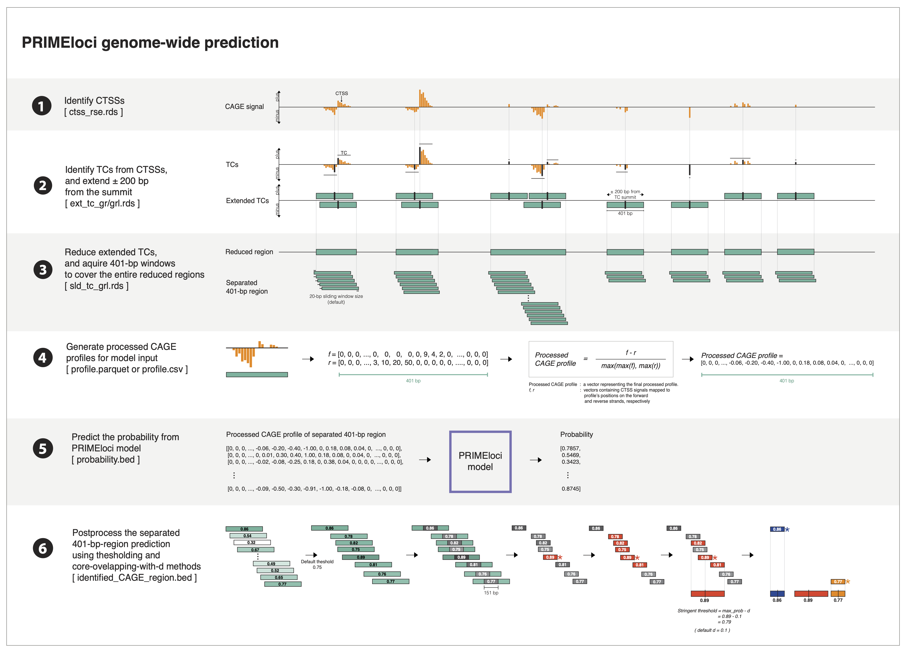

# PRIMEloci

The PRIMEloci repository offers tools for genome-wide prediction of regulatory elements from CAGE data using machine learning models. The core model, based on LightGBM, was trained on GM12878 whole-cell CAGE and nucCAGE data from the Andersson lab. PRIMEloci automates the workflow from bigWig files to accurately identified enhancers and promoters, providing flexibility for users to either use bash scripts for a full pipeline execution or directly interact with R functions within PRIME package. While the project was initially developed based on the human genome hg38, it can be adapted for use with other species.

Execute a full pipeline or some parts of the pipeline using pre-configured bash scripts, ideal for users who prefer a command-line interface or need to automate large-scale data processing tasks. Each step can be run individually or as part of a pipeline with a main bash script for selective execution.


## Table of Contents

- [Overview](#overview)
- [Installation](#installation)
- [Main concept of PRIMEloci for genomewide prediction](#mainconceptofPRIMElociforgenomewideprediction)
- [Usage of Bash Script](#usageofbashscript)
- [Contributing](#contributing)
- [License](#license)


## Installation

To install PRIMEloci, follow these steps:

1. **Install PRIME R package**:

   Ensure you have R version 4.4 or higher (It was implemented under R.4.4). Open R or RStudio and install the PRIME package. The instruction can be found at https://github.com/anderssonlab/PRIME/. Note that PRIME is R package, however, python is also needed to run the prediction as instructed in PRIME repository.

2. **Clone the repository**:

   ```bash
   git clone https://github.com/anderssonlab/PRIMEloci
   ```

3. **Make sure that the main script executable**:

   ```bash
   cd PRIMEloci/genomewide_prediction
   chmod +x PRIMEloci.sh
   ```

4. **Copy the example resources and model for demonstration**:

   ```bash
   
   ```

These steps will set up the necessary environment for running PRIMEloci scripts. You can now proceed with executing the main script or individual scripts as needed.


## Main concept of PRIMEloci for genomewide prediction

1. the main **PRIMEloci workflow** [running with **./PRIMEloci.sh --PRIMEloci**]

​	The workflow focuses on the prediction of regulatory elements using machine learning, encompassing six key steps:	

​	1) **Extracting CTSS Data** : Extract CAGE transcriptional start site (CTSS) objects from bigWig files using the CAGEfightR package.

​	2) **Identifying Tag Clusters (TCs)** : Identify tag clusters (TCs) from the extracted CTSS data using the CAGEfightR package.

​	3) **Sliding Through TCs** : Slide through the identified TCs, default setting the window size to 20, to prepare data for downstream analysis.

​	4) **Creating Normalized Profiles **: Generate normalized profiles for input into the prediction model.

​	5) **Predicting Profile Probabilities **: Use PRIMEloci models to predict the probabilities of regulatory elements.

​	6) **Post-Processing** : Refine and filter predictions using additional criteria for improved accuracy, outputting non-overlapping loci in `.bed` format for further analysis in R.

​	Each of these steps can be run separately, and **recommended running it separately for the larger dataset** (either large number of libraries or very high sequencing depth). All intermediate files here will be kept as it may be used later on for the downstream analysis. 

2. **PRIMEloci focal workflow** [running with **./PRIMEloci.sh --PRIMEloci_focal**]

   ​	This workflow is designed to use prediction results generated by PRIMEloci or from fixed genomic regions. The input consists of:

   - **CTSS data** stored in a `RandomizedSumExperiment` object (`ctss_rse.rds`)

   - **Genomic regions** defined as a `GRanges` object (`region.rds`)

     These CTSS signals are mapped to the specified regions, and normalized profiles (step -4) is generated. Predictions (step -5) are then made for each region across all libraries.

   ​	This workflow was developed as part of the **PRIMEloci × FANTOM5** project and is applicable to a variety of use cases. Briefly, the project began by calling CTSS using CAGEfightR and pooling all libraries from the FANTOM5 database. After applying light filtering, the data were saved as an `.rds` file. PRIMEloci steps 2–6 were then executed on the pooled data to generate prediction outputs. Subsequently, step -7 was used to convert the pooled predictions into a `GRanges` `.rds`file representing the predicted genomic regions. These pooled predicted regions were then used as input for the focal PRIMEloci analysis. In this step, CTSS data from each individual FANTOM5 library (not the pooled one) and the pooled predicted regions were used to run focal PRIMEloci, producing cell-facet-level data for further analysis.

   ​	Downstream analyses based on this pipeline can be found here:
   ​	*[Add reference + figure for PRIMEloci × FANTOM5 here]*


## Usage of Bash Script

To use PRIMEloci, follow these steps:

1. **Navigate to the Genome-wide Prediction Directory** (or else run the full path to the PRIMEloc.sh script)

   ```bash
   cd PRIMEloci/genomewide_prediction
   ```

2. **Configure Parameters**

   This workflow is designed to use a configuration file to ensure that all parameters are explicitly defined, helping to prevent confusion around file paths and settings across different steps. Example configuration files are available at:

   - `path/to/PRIMEloci/genomewide_prediction/bash_config_PRIMEloci.sh`
   - `path/to/PRIMEloci/genomewide_prediction/bash_config_PRIMEloci_focal.sh`

   To run the workflow, provide a valid configuration file using the `--config` option. This file must specify all required parameters for the script. The included example settings are compatible with CAGE files located in `PRIMEloci/example/resources`.

3. **Run the Scripts**

   Execute the desired steps with the following options:

   - **Run PRIMEloci and PRIMEloci_focal**: 
     
     ```bash
     ./PRIMEloci.sh --config <config_file> --PRIMEloci
     ./PRIMEloci.sh --config <config_file> --PRIMEloci_focal
     
     # example <config_file>
     ./PRIMEloci.sh --config bash_config_PRIMEloci.sh --PRIMEloci
     ./PRIMEloci.sh --config bash_config_PRIMEloci_focal.sh --PRIMEloci_focal
     ```
     Note that if you prefer to run the full workflow in small samples or if server storage is limited, it is recommended to execute the workflow directly within R. This approach runs all steps sequentially and automatically cleans up intermediate files to reduce storage usage.

   - **Run individual steps**
     
     ```bash
     ./PRIMEloci.sh --config <config_file> -3 -4 
     ```
     Each step corresponds to a specific script or function:
     
   - `-0`: Validation CTSS data and given regions
   
   - `-1`: Extract CTSS data
   
   - `-2`: Identify tag clusters
   
   - `-3`: Slide through TCs with a specific window size
   
   - `-4`: Create normalized profiles
   
   - `-5`: Predict regulatory element probabilities
   
   - `-6`: Apply post-processing to refine predictions
   
   - `-7`: Prepare the post-processed bed for focal input
   
     ​	This step structure can also be used flexibly as needed. For example, if PRIMEloci step -1 (CTSS calling) has already been completed externally and CTSS data are available, you can start directly from step -2 and continue with steps -3, -4, -5, and -6.
   
     ​	Each step is designed to run independently, allowing users to execute one step at a time and stack the outputs sequentially. This modular design is useful for customizing the workflow, reusing intermediate results, or managing large datasets step by step.
   
     ​	Note that The **PRIMEloci** workflow consists of steps **-1 to -6**, each corresponding to an individual script. The **PRIMEloci_focal** workflow includes steps **-0**, **-4**, and **-5**, which are designed to be run on individual libraries using the predicted regions.


## Contributing

Contributions are welcome! Please submit a pull request or open an issue to discuss any changes or improvements.


## License
